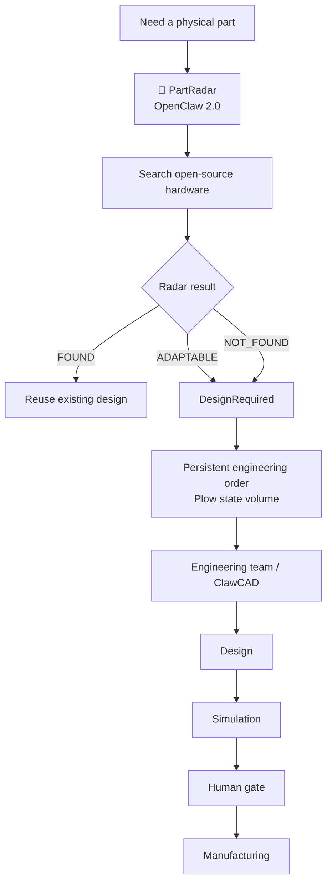
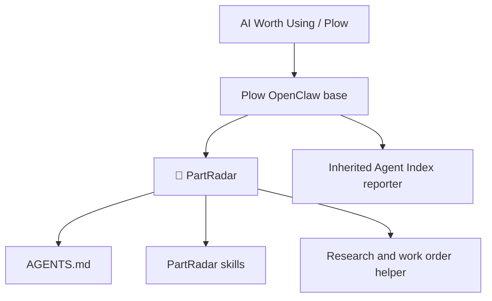

# PartRadar 📡

Search first. Design only when necessary.

PartRadar is an AI Worth Using OpenClaw 2.0 app that searches the open-source hardware ecosystem before new mechanical engineering work begins. If the part already exists, reuse it. If it almost fits, create a local engineering order for ClawCAD adaptation. If nothing suitable exists, request a new ClawCAD design through the same local order.

**PartRadar finds it before ClawCAD builds it.**

**PartRadar discovers whether we need to design. ClawCAD decides how we design it.**

## How it works





PartRadar is a **Build on Plow** variant image. Its Dockerfile inherits the maintained [Plow OpenClaw base](https://github.com/plow-pbc/plow-openclaw-agent), pinned at upstream commit `e0217de7c4fc5d8b7655aa4a1aaac8ed9f79cdf7` and image digest `sha256:8696c41d26305fa28e825fb72531fade37e9dd2ad52df2fdb395f68681523243`. It replaces only the agent prompt, adds three skills, and includes a small deterministic artifact renderer. OpenClaw remains the runtime. Plow provides phone conversations, its channel/plugin, gateway, state volume, model access, and Agent Index registration and five-minute usage reporting. No second reporter runs here. See [architecture](docs/architecture.md).

## Try it locally

Follow the [installation guide](docs/install.md). In brief, install Docker Compose and the current [`plow-agents` CLI](https://github.com/plow-pbc/plow-agents), log in, choose a free line, set the owner-selected `AGENT_ID` in an ignored `.env`, and run `plow-agents deploy --local --line ln_xxx` from this directory. That command mints `plow-credentials` and starts Compose. Text the listed phone number; the conversation is the product interface. `AGENT_ID` is required for Index publication and reporting, but its final value is deliberately left to the owner.

Example request: “I need an FDM-printable enclosure for a Raspberry Pi Zero with an RPIZ CAM 5MP 120 camera.” PartRadar searches for existing designs, cites their license and files, and replies `FOUND`, `ADAPTABLE`, or `NOT_FOUND`. For the latter two, it persists the research, a `DesignRequired` event, and an open engineering work order under `/var/lib/plow/research/REQ-NNNN/`. The engineering team can review the local order through the agent or Plow state volume. PartRadar does not make CAD or simulation calls. The [demo guide](docs/demo.md) includes a real, source-backed `ADAPTABLE` example.

Run the deterministic demo artifact locally without an agent account:

```sh
python3 tools/part_radar.py examples/pi-zero-camera-research.json --out artifacts
cat artifacts/REQ-0042/research.yaml
cat artifacts/REQ-0042/design-required.json
cat artifacts/REQ-0042/engineering-order.json
```

This fixture demonstrates artifact rendering from inspected sources. It is not a recorded live OpenClaw conversation or proof that the engineering team has reviewed the order.

## Publication

PartRadar is MIT licensed. The target repository is [edge-robot/partradar](https://github.com/edge-robot/partradar). The [publishing checklist](docs/publishing.md) tracks its public availability, the public digest-pinned image, Index metadata and usage, verification, one-click admission, demo video, and real screenshot. The final agent slug, video, and image still need to be supplied by the owner.

Upstream references: [AI Worth Using publication guide](https://aiworthusing.com/agent-index/publish), [Plow OpenClaw base](https://github.com/plow-pbc/plow-openclaw-agent), [`plow-agents`](https://github.com/plow-pbc/plow-agents), and [Agent Index client](https://github.com/plow-pbc/agent-index-client).
